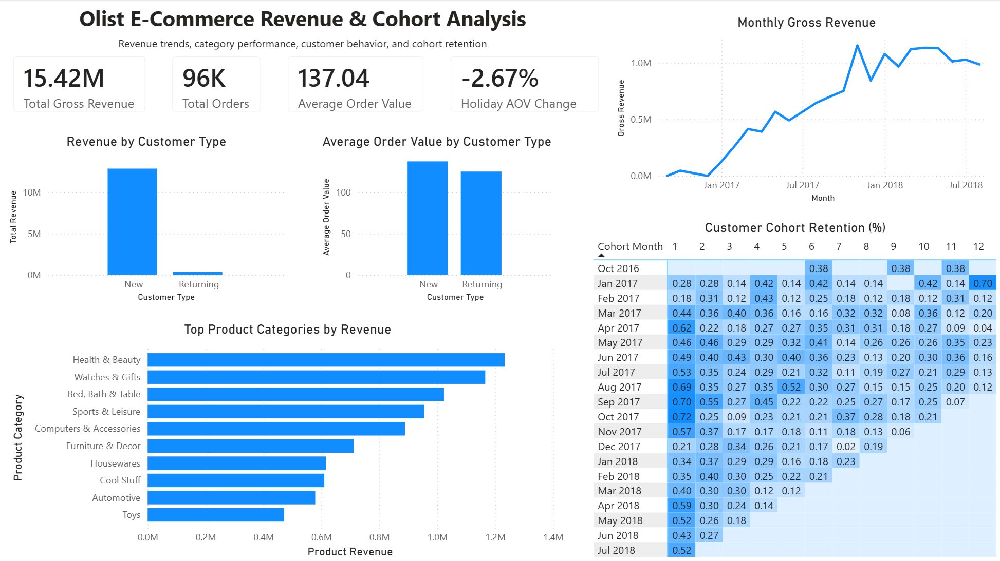

# Olist E-Commerce Revenue & Cohort Analysis

**Revenue growth, category concentration, and customer retention across ~96,000 delivered
orders on a Brazilian e-commerce marketplace — and the acquisition-dependence problem
hiding underneath the growth curve.**


---

## Headline

| Metric | Value |
|---|---|
| Delivered orders analysed | **96,478** |
| Unique customers | **93,358** |
| Time window | **Sep 2016 → Aug 2018** (23 months) |
| Total gross revenue | **R$15.42M** (R$13.22M product + R$2.20M freight) |
| Average order value | **R$137.04** |
| Customers who ever placed a second order | **3.0%** |

## TL;DR — Key findings

1. **Revenue grew +143% year over year** — R$3.47M (Jan–Aug 2017) → R$8.45M (Jan–Aug 2018) — peaking at **R$1.15M in November 2017** (Black Friday), then plateauing at ~R$1.0–1.1M/month through 2018.
2. **The growth is entirely acquisition-driven.** First-time orders generated **97.3% of product revenue**; only **3.0%** of 93,358 customers ever placed a second delivered order.
3. **Cohort retention is near zero, in every cohort.** Month-1 retention for mature cohorts (500+ customers) averages **0.5%** and never exceeds 0.72%. Only ~1.4% of customers make any repeat purchase within six months. This is not a weak-cohort problem — it is structural.
4. **Revenue is concentrated in a few categories** — the top 5 of 72 categories account for **39.8%** of product revenue (top 10 = 62.4%), led by Health & Beauty (9.3%) and Watches & Gifts (8.8%).
5. **Returning customers spend *less*, not more** — average order value R$125.08 vs R$137.41 for first orders (**−9%**). Repeat purchases are not premium purchases.
6. **Holiday months don't lift basket size.** Nov–Dec average order value is **−2.67%** vs the rest of the year. The November 2017 revenue peak was a *volume* story (7,289 orders), not a basket-size story.

Each finding is expanded with supporting numbers and a business implication in
[Findings & recommendations](#findings--recommendations) below.

---

## Dashboard preview

Single-page Power BI dashboard reading directly from the PostgreSQL reporting views.

[](outputs/dashboard.png)

The dashboard covers: headline KPIs (gross revenue, orders, AOV, holiday AOV change),
the monthly gross-revenue trend, revenue and AOV split by new vs returning customers,
top product categories by revenue, and the customer cohort retention matrix.

---

## The business problem

A marketplace that more than doubles revenue year over year looks healthy. But topline
growth can hide a structural weakness: **if nearly all revenue comes from first-time
buyers, growth is rented, not owned** — it lasts exactly as long as the acquisition
spend behind it.

This analysis separates Olist's revenue into its acquisition and retention components
to answer the question a growth or CRM stakeholder would actually ask:

> *"Is our growth compounding — are customers coming back and buying more — or are we
> buying every order with new-customer acquisition?"*

The answer (finding 2 and 3): almost entirely the latter, which reframes retention as
Olist's largest untapped lever.

---

## The data

| Attribute | Details |
|---|---|
| Source | [Olist Brazilian E-Commerce Public Dataset](https://www.kaggle.com/datasets/olistbr/brazilian-ecommerce) (Kaggle) — real, anonymised marketplace transactions |
| Time window | Sep 2016 → Aug 2018 |
| Scope | 96,478 **delivered** orders · 93,358 unique customers · 72 product categories |
| Tables used | `orders`, `order_items`, `customers`, `products`, `category_translation` |
| Currency | Brazilian reais (R$), nominal |

### Two scope decisions worth defending

- **Delivered orders only.** Revenue is calculated from completed transactions.
  Including shipped, processing, or cancelled orders would inflate revenue with money
  Olist may never have collected. The filter is applied once, in the base view, so
  every downstream metric inherits it.
- **`customer_unique_id`, not `customer_id`.** In this dataset `customer_id` is unique
  *per order* — using it would make every customer look new and silently destroy the
  retention analysis. All repeat-purchase logic keys on `customer_unique_id`, which
  identifies the person across orders. This is the single most consequential modelling
  decision in the project.

---

## Findings & recommendations

All findings are computed by the reporting views in
[`sql/08_create_reporting_views.sql`](sql/08_create_reporting_views.sql) and surfaced
on the Power BI dashboard.

### 1. Revenue grew +143% YoY, then plateaued at a ~R$1M monthly run rate

**Number.** Comparing like-for-like periods: Jan–Aug 2017 = R$3.47M gross revenue vs
Jan–Aug 2018 = R$8.45M (**+143%**). Monthly revenue peaked at **R$1.15M in November
2017** (Black Friday — also the largest cohort: 7,060 new customers) and held a
~R$1.0–1.1M monthly range through 2018 with no sustained growth after Q1.

**Source visual.** Monthly Gross Revenue line chart.

**Business implication.** The hypergrowth phase ended around early 2018. From that
point, growth has to come from somewhere other than momentum — which makes the
retention findings below the central strategic question.

### 2. Growth is acquisition-driven to an extreme degree

**Number.** First-time orders: 93,613 orders, **R$12.86M (97.3% of product revenue)**.
Returning-customer orders: 2,865 orders, R$0.36M (**2.7%**). Only **2,824 of 93,358
customers (3.0%)** ever placed a second delivered order.

**Source visual.** Revenue by Customer Type bar chart.

**Business implication.** Olist's revenue engine is a one-shot funnel: acquire,
convert once, lose. Every month's revenue must be re-purchased through acquisition.
There is effectively no compounding customer base, and customer lifetime value ≈
first-order value, which caps how much Olist can rationally spend to acquire a
customer.

### 3. Retention is uniformly near zero — a structural pattern, not a bad cohort

**Number.** Across all 19 mature cohorts (≥500 customers), month-1 retention sits
between **0.18% and 0.72%** (average ~0.5%), and only **~1.4%** of customers return
within six months of their first purchase. No cohort — early or late, small or large,
holiday or not — breaks the pattern.

**Source visual.** Customer Cohort Retention matrix (month 0 excluded — it is 100% by
definition and would compress the colour scale that makes the heatmap readable).

**Business implication.** Because the pattern holds for *every* cohort, the cause is
unlikely to be a specific campaign, season, or service failure. It is structural:
either the product mix doesn't generate repurchase cycles, or the marketplace
experience (Olist sells via storefronts on other channels) doesn't create a
relationship the customer can return to. Distinguishing those two explanations is the
top item in [Next steps](#next-steps).

### 4. Revenue concentrates in a handful of categories

**Number.** The top 5 of 72 categories drive **39.8%** of product revenue; the top 10
drive **62.4%**.

| Category | Product revenue | Share |
|---|---:|---:|
| Health & Beauty | R$1.23M | 9.3% |
| Watches & Gifts | R$1.17M | 8.8% |
| Bed, Bath & Table | R$1.02M | 7.7% |
| Sports & Leisure | R$0.95M | 7.2% |
| Computers & Accessories | R$0.89M | 6.7% |

**Source visual.** Top Product Categories by Revenue bar chart.

**Business implication.** Category strategy has leverage: promotions, seller
recruitment, and inventory depth in the top 10 categories touch nearly two-thirds of
revenue. Notably, the #1 category (Health & Beauty) is *replenishable* — the natural
place to test whether retention can be manufactured (finding 3).

### 5. Returning customers spend less per order, not more

**Number.** AOV for returning-customer orders is **R$125.08** vs **R$137.41** for
first orders (**−9%**).

**Source visual.** Average Order Value by Customer Type bar chart.

**Business implication.** The rare customers who do come back are not upgrading — if
anything, second purchases skew smaller. A retention programme can't assume repeat
buyers become high-value buyers by default; basket-building (bundles, cross-sell,
free-shipping thresholds) must be designed into it.

### 6. Holiday months are a volume play, not a basket play

**Number.** Nov–Dec orders average **R$133.86** vs **R$137.53** in the rest of the
year (**−2.67%**). Yet November 2017 was the single biggest revenue month (R$1.15M)
on the strength of order *count*.

**Source visual.** Holiday AOV Change KPI card + Monthly Gross Revenue trend.

**Business implication.** Holiday demand brings more, slightly smaller orders —
consistent with discounting and gift purchases. Planning should optimise for
throughput (logistics capacity, seller stock) rather than expecting seasonal AOV
uplift.

### Synthesised recommendations

1. **Treat retention as the largest untapped lever.** Repeat business is 2.7% of
   revenue; even doubling the repeat rate from 3% to 6% adds roughly R$350K+ at
   current AOV — without acquiring a single new customer.
2. **Run the first retention experiments in replenishable categories.** Health &
   Beauty is simultaneously the #1 revenue category and the most natural repurchase
   cycle. Post-purchase replenishment reminders and category-specific win-back offers
   are the cheapest test of whether the retention floor can move.
3. **Design basket-building into any repeat-purchase programme** (finding 5):
   returning buyers currently spend 9% less, so loyalty incentives should be
   structured around order-value thresholds, not flat discounts.
4. **Plan holiday peaks for volume, not value.** Capacity, fulfilment, and seller
   stock matter more than premium pricing in November.
5. **Before spending on retention, diagnose it** — the analysis in
   [Next steps](#next-steps) (retention by category, delivery-delay impact, review
   scores) determines whether low retention is a product-mix fact to accept or an
   experience failure to fix.

---

## Methodology

The pipeline is deliberately simple and inspectable: **raw CSVs → PostgreSQL →
one canonical base view → reporting views → Power BI.**

| Stage | What was done | Artifact |
|---|---|---|
| 1. Sanity checks | Row counts, status distribution, date ranges, key uniqueness on the raw tables | [`sql/01_sanity_checks.sql`](sql/01_sanity_checks.sql) |
| 2. Analytical base | `sales_base` view: delivered-orders filter + customer/product/category joins + `gross_revenue` computed once | [`sql/02_create_sales_base.sql`](sql/02_create_sales_base.sql) |
| 3. Exploratory analysis | Monthly revenue, category performance, new-vs-returning, cohort retention, holiday AOV — each developed as a standalone query | [`sql/03`](sql/03_monthly_revenue.sql)–[`07`](sql/07_holiday_uplift.sql) |
| 4. Reporting layer | The exploratory queries hardened into 7 named views that Power BI reads directly | [`sql/08_create_reporting_views.sql`](sql/08_create_reporting_views.sql) |
| 5. Dashboard | Single-page Power BI report over the views | [`olist_dashboard.pbix`](olist_dashboard.pbix) |

### Design decisions that protect the numbers

- **The SQL view layer is the single source of analytical truth.** Power BI contains
  no business logic — every visual reads a `vw_*` view, so a wrong number can only be
  wrong in one inspectable place, not in a hidden DAX measure.
- **AOV is computed at order grain, not item grain.** Item-level rows are collapsed to
  one row per order *before* averaging; otherwise multi-item orders would be
  over-weighted and AOV would silently become "average item price".
- **New vs returning is classified per order, not per customer.** A customer's first
  order counts as New and all subsequent orders as Returning — so the revenue split
  measures *behaviour over time*, not a static customer label.
- **Gross revenue (price + freight) and product revenue (price only) are kept as
  separate metrics** and never mixed: headline revenue is gross; AOV and category
  shares use product revenue.

### Reporting views (the analytical API)

| View | Drives | Question answered |
|---|---|---|
| `vw_kpi_summary` | KPI cards | Headline totals (one row) |
| `vw_monthly_revenue` | Revenue trend line | How did revenue, orders, and customers move month to month? |
| `vw_category_performance` | Category bar chart | Which categories drive revenue? |
| `vw_new_vs_returning` | Customer-type bars | Acquisition vs retention revenue split |
| `vw_holiday_summary` / `vw_holiday_uplift` | Holiday KPI card | Do Nov–Dec orders differ in value? |
| `vw_cohort_retention` | Cohort matrix | Do customers come back after their first purchase? |

---

## Limitations

The findings are robust, but they sit on these constraints:

1. **The observation window truncates repeat cycles.** The data ends in Aug 2018, so
   recent cohorts have had little time to repurchase. Retention figures are therefore
   *floor* estimates — but the sub-1% month-1 pattern holds even for the earliest
   cohorts with 18+ months of runway, so the structural conclusion stands.
2. **The ~3% repeat rate is partly a known dataset characteristic.** Olist's public
   dataset identifies customers via `customer_unique_id`; any repeat purchases that
   identity-matching missed would raise true retention somewhat. It would not raise it
   to healthy e-commerce levels (20–30% repeat is typical).
3. **2016 data is a pilot-period stub** — 267 orders total, and November 2016 has zero
   delivered orders. Growth comparisons therefore use 2017 vs 2018, never 2016.
4. **"Holiday" is a simplified Nov–Dec definition.** Brazil's retail calendar has
   other significant dates (Dia das Crianças in October, Dia dos Namorados in June)
   that this binary flag ignores.
5. **No marketing-channel data** — acquisition cost and channel attribution are
   impossible, so "acquisition-driven growth" can be measured but not costed.
6. **Revenue is nominal BRL.** Brazilian inflation over 2016–2018 (~3–6%/yr) modestly
   flatters the growth rate.

---

## Next steps

In priority order — the first three all attack the same question: *is low retention a
product-mix fact or an experience failure?*

1. **Retention by product category** — do replenishable categories (Health & Beauty)
   actually retain better than durables (Furniture, Computers)?
2. **Delivery-delay impact on repurchase** — join actual vs estimated delivery dates
   to cohort behaviour; late first orders may kill second orders.
3. **Review-score → repurchase linkage** using `order_reviews`.
4. **Customer lifetime value estimation**, once the retention drivers are understood.
5. **Seller-level performance analysis** — the marketplace's supply side.
6. **Geographic split** (state-level revenue and retention) with dashboard slicers.

---

## Repository structure

```
.
├── README.md
├── olist_dashboard.pbix               Power BI dashboard (reads the vw_* views)
├── outputs/
│   └── dashboard.png                  Dashboard export used in this README
└── sql/
    ├── 01_sanity_checks.sql           Raw-table profiling and QA
    ├── 02_create_sales_base.sql       Canonical delivered-orders base view
    ├── 03_monthly_revenue.sql         Revenue trend exploration
    ├── 04_category_performance.sql    Category revenue exploration
    ├── 05_new_vs_returning.sql        Customer-type classification logic
    ├── 06_cohort_retention.sql        Cohort matrix construction
    ├── 07_holiday_uplift.sql          Holiday vs non-holiday AOV
    └── 08_create_reporting_views.sql  The 7 production views Power BI reads
```

Raw data is not committed (≈125 MB of CSVs) — download it from
[Kaggle](https://www.kaggle.com/datasets/olistbr/brazilian-ecommerce).

---

## How to reproduce

1. Download the [Olist dataset](https://www.kaggle.com/datasets/olistbr/brazilian-ecommerce)
   from Kaggle.
2. Create a PostgreSQL database (e.g. `olist_analytics`) and import the CSVs as tables:
   `orders`, `order_items`, `customers`, `products`, `category_translation`
   (pgAdmin's import tool or `\copy` both work).
3. Run the SQL scripts in order, `01` → `08`, against that database.
4. Open `olist_dashboard.pbix` in Power BI Desktop, point the data source at your
   local PostgreSQL instance, and refresh.

## Tech stack

| Layer | Tool |
|---|---|
| Storage, modelling, analysis | PostgreSQL 18 |
| Business logic | SQL (views, CTEs, window functions) |
| Dashboard | Power BI Desktop |
